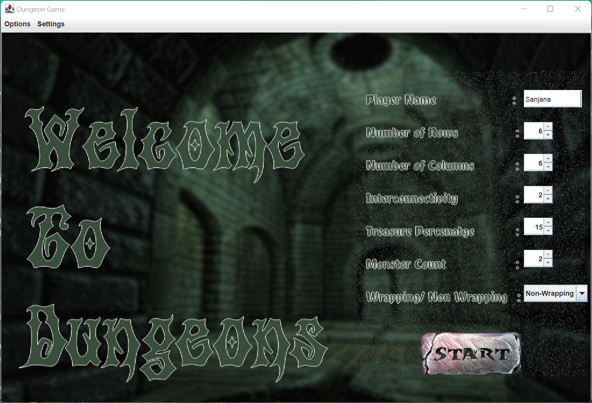
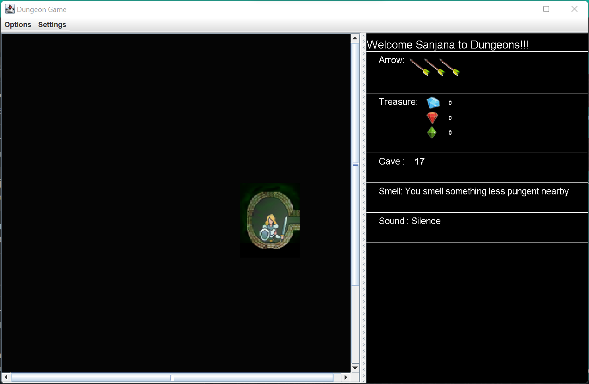
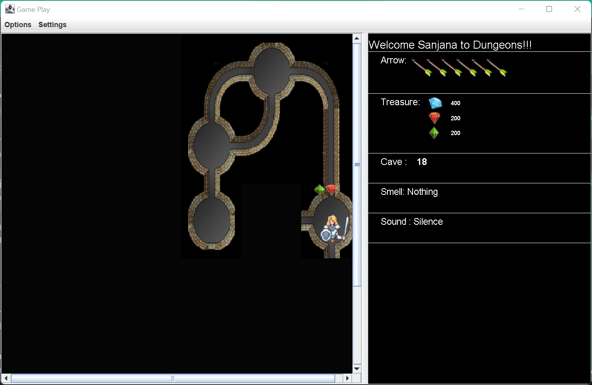

<!-- PROJECT LOGO -->
<br />
<div align="center">
  <a>
    
  </a>

<h3 align="center"> <strong>Welcome to Dungeon Games!!!</strong> </h3>


</div>

  <p align="center">
    <strong>Welcome to the World of Dungeons!!!</strong>
</p>

<!-- TABLE OF CONTENTS -->
<details open="open">
  <summary>Table of Contents</summary>
  <ol>
    <li>
      <a href="#about-the-project">About The Project</a>
    </li>
    <li>
      <a href="#list-of-features">List Of Features</a>
    </li>
    <li>
      <a href="#getting-started">Getting Started</a>
      <ul>
        <li><a href="#how-to-run">How to Run</a></li>
        <li><a href="#installation">How to Use Program</a></li>
      </ul>
    </li>
    <li><a href="#Description">Description of Examples</a></li>
    <li><a href="#assumptions">Assumptions</a></li>
    <li><a href="#limitations">Limitations</a></li>
     <li><a href="#design-and-model-changes">Design and Model Changes</a></li>
    <li><a href="#citations">Citations</a></li>
    <li><a href="#note">Note</a></li>
  </ol>
</details>

<!-- ABOUT THE PROJECT -->

## About The Project

Our game's world is made up of a model and a network of tunnels and caves that are 
linked together so that the player can explore the entire world by traveling from cave
to cave via the tunnels that connect them. Let's get started and look at some cool features.
The Dungeon is filled with Monsters (Otyughs), which players can shoot with arrows as they
move through caves. The Dungeons are filled with Jewels and Arrows.

The game proceeds as follows:

* The game begins by initializing a model based on inputs provided by the client. 
* These inputs include the model's size, treasure percentage, interconnectivity within the model, whether the model wraps or not, and the number of monsters. 
* Two caves are randomly designated as the start and end caves, and the player's goal is to reach the end cave beginning at the start cave.
* Along the way, the player discovers treasure and arrows in caves. RUBY, SAPPHIRE, and DIAMONDS are currently available treasures.
* If there is a path connecting his current cave to the next cave, the player can move in one of four directions (NORTH, SOUTH, EAST, and WEST).
* Players can shoot the monsters and kill them.
* Finally, the player wins when he reaches the end cave without a monster or encounters a half injured monster.

<!-- Guidelines to the Player -->

## Guidelines to the Player

### <strong> <u> <i> Game Controls:  </i> </u> </strong>
Player has Various Controls that he/she can use to play the Game with. Following are some of the Controls.

1. "W","A","S", "D" keys is to move in North, West, South and East direction.
2. "P" key is to pickup Arrows.
3. "1","2","3" represents Diamonds, Ruby, Sapphire followed by "T" is to pickup Treasure. 
4. "Number of Caves" followed by Arrow control in the direction to shoot the arrow are controls to shoot arrows.

### <strong> <u> <i> Monsters:  </i> </u> </strong>
Otyughs (Links to an external site.) are extremely smelly creatures who live alone in the world's deep, dark places, such as our dungeon.

* At the end cave of the dungeon, there is always at least one Otyugh. 
* Otyughs are only found in caves, never in tunnels. They can be identified by their odor. 
* In general, the player has two levels of smell detection:
1. When there is a single Otyugh 2 positions from the player's current location, a less pungent smell can be detected.
2. A stronger odor when there is a single Otyugh 1 position away from the player's current location, or multiple Otyughs within 2 positions away from the player's current location.
* A player who enters a cave with an unslayed Otyugh will be killed and eaten.


### <strong> <u> <i> Slaying a Monster:  </i> </u> </strong>
A player with arrows can attempt to slay an Otyugh by specifying a paths and distance for their crooked arrow to be shot. The number of caves (but not tunnels) that an arrow travels is defined as its distance. Arrows can freely travel through tunnels (even crooked ones), but only in a straight line through a cave.

1. In a tunnel with exits to the west and south, an arrow can enter the tunnel from the west and exit to the south, or vice versa (this is the reason the arrow is called a crooked arrow).
2. In a cave with exits to the east, south, and west, an arrow can enter from the east and exit to the west, but an arrow entering from the south will be stopped because there is no exit to the north.
* All distances must be precise. For example, if you shoot an arrow three distances east and the Otyugh is two distances east, you will miss the Otyugh. 
* An Otyugh can be killed with two hits. If players enter the cave of an injured Otyugh hit by a single crooked arrow, they have a 50% chance of escaping the Otyugh.


<!-- List of Features -->

## List of Features

The 'World of Dungeons' provides the user with the following features/benefits: 
* The Game can be played in both GUI and Console Based.
* The game supports both wrapping and non-wrapping dungeons, making the game more challenging.
* In GUI based Game player can explore the dungeons and unlock more paths.
* Supports three types of treasures.
* Allows the client to select the percentage of treasure he wants to assign to the model, whether the model should be wrapped or not, the size of the model, and so on. The game is made more interactive by allowing users to choose their next move and to pick up treasure as they see fit.
* At any time, the user can inquire about the player's current location and the status of the treasure he is carrying.
* Collect and deploy Arrows to shoot your way through the caves. 
* Shoot and kill the Otyughs. 
* Otyughs should be added to the caves.

<!-- Getting Started -->

## Getting Started

### How to Use

The folder structure of the project basically contains three directories.

* src directory contains all the interfaces and the classes.
* test directory contains all the test cases for every class's public methods.
* res directory contains docs, jar file, and manifests

User can <a href="#run-the-jar"> run the jar file </a> directly or use the driver class to execute
the project.

<!-- run-the-jar -->

### How to Run
<strong><u> Running Using A Jar File For GUI based Game</u></strong>

To run the jar file use the following command in the terminal.

```
java -jar <jarName>
```

The jar file added in the res folder is name Project5_Graphical_Adventure_Game.jar.

<strong><u> Running Using A Jar File For Command Line / Console Based Game</u></strong>

To run the jar file use the following command in the terminal.

```
java -jar <jarName> <no_of_rows> <no_of_columns> <degree_of_interconnectivity> <isWrapping?> <treasure_Percentage> <number_of_monster>
```

The jar file added in the res folder is name Project5_Graphical_Adventure_Game.jar.

<strong> <u> Running Driver Class </u> </strong>

If you want to play Console Bases game edit your program configurations to take in command line inputs as per your IDE. The inputs should be in the same order as <i> <no_of_rows> <no_of_columns> <degree_of_interconnectivity> <isWrapping?> <treasure_Percentage> <number_of_monster></i>.
If not then directly start the game.

Navigate to src/driver directory. You will find a *Driver* class with main method in it.
Right click and Run the program.

<!-- Description of Examples-->

## Description of Console Based Examples

As a sample dry run, I have executed the program multiple times:

The run demos a following features:
1. Initially, the model's details, such as the player's location, treasure, and the number of arrows with are printed.
2. The user is unable to see the model and all of its connections.
3. After each move, the user is asked whether they want to go to another cave, pick up the treasure, or shoot an arrow.
4. The game progresses based on the option selected by the player.
5. The treasure gathered continues to grow until the end.
6. The player can use the arrows to kill monsters and collect more arrows.
7. The player dies if he enters the cave with a fully healthy monster.
8. If the player enters the cave with an injured monster, he or she has a 50% chance of surviving. 
9. The game will continue until you reach the end cave.

<b><i> Run 1 One run that shows the player navigating through the dungeon </i></b>

<b><i> Run 2 One run that shows the player picking up treasure </i></b>

<b><i> Run 3 One run that shows the player picking up arrows </i></b>

<b><i> Run 4 One run that shows the player being eaten by a Otyugh </i></b>

<b><i> Run 5 One run that shows the player killing a Otyugh </i></b>

<b><i> Run 6 One run that shows the player killing a Otyugh </i></b>

<!-- Assumptions -->

## Assumptions

The following assumptions have been made in order to successfully implement the project.

1. It is assumed that the product of the number of rows and columns in a model is greater than 10.
2. The provided interconnectivity should have a positive value.
3. A cave can have multiple treasures, and the maximum value of a single treasure is 300.
4. When interconnectivity is very high and the model does not have that many leftover paths to connect, all of the leftover paths are connected and the program continues.
5. Tunnels do not contain any treasure.
6. A player can only move in four directions and cannot move diagonally through Caves.
7. The Treasure Percentage will be calculated in the non-Tunnel Caves.
8. The player can shoot arrows, but they will hit any Monster or Otyugh if the distance is exact.
9. Each cave can only contain one monster and one arrow.

<!-- Limitations -->
## Limitations

1. Because the distance between the start and end caves must be kept to a minimum of 5, the grid must be chosen accordingly. Smaller row and column values may cause the program to run in an infinite loop in search of a suitable start and end path.
2. For a trouble-free gaming experience, choose a size larger than 4x4.
3. Only one player can play at the same time.
4. Supports only three types of Treasure but meets the requirement of supporting at least three Treasure types.
5. There is only one type of Monster available.
6. High percentages of treasure can be difficult to allot because they can be placed in tunnels.

<!-- Design and Model Changes -->

## Design and Model Changes

* The design and UML diagram can be found in the res folder.
* New GUI based game is added along with teh Console Based Game.
* No Changes To the Model were made.

ScreenShots:



!


<!-- Citations -->

## Citations
1. [Finding paths between 2 nodes in the grid](https://www.geeksforgeeks.org/find-paths-given-source-destination/)
2. [JavaDoc for Using Randon Integer generator](https://docs.oracle.com/javase/8/docs/api/java/util/Random.html)
3. https://www.geeksforgeeks.org/treeset-in-java-with-examples/#:~:text=TreeSet%20is%20one%20of%20the
4. https://docs.oracle.com/javase/8/docs/api/java/lang/Comparable.html
5. https://www.javatpoint.com/Comparable-interface-in-collection-framework
6. https://stackoverflow.com/questions/13334198/java-custom-buttons-in-showinputdialog
7. https://docs.oracle.com/javase/tutorial/uiswing/layout/visual.html
8. https://docs.oracle.com/javase/tutorial/uiswing/components/splitpane.html
9. https://docs.oracle.com/javase/tutorial/uiswing/components/dialog.html
10. https://www.geeksforgeeks.org/java-swing-jdialog-examples/
11. 
<!-- Note -->

## Note
I have not uploaded code for academic reasons; please contact me for more information on the project.